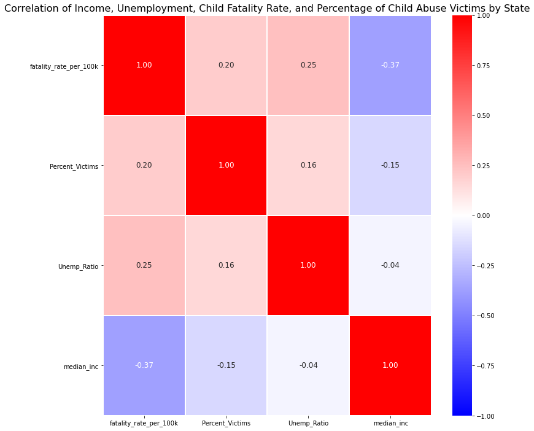

# DATA 211 Final
#### Background
For the final project, I started by analyzing child abuse statistics in the United States. The original data contained the number of child abuse cases per state in 2018. As expected, the states with larger populations had more child abuse cases. Importing U.S. census data, I was able to find the number of children (under the age of 18) in each state. To standardize the data, I divided the total child abuse cases in each state by the number of children in each state. In order to grow understanding of child abuse, I decided to compare the percentage of child abuse to median income, unemployment rates, and the child fatality rate in each state. Looking at a heatmap of the correlations of these features, you can quickly see that there is not a strong relationship between any of these features. 

#### Findings
Although the heat map does not show strong correlations, there were some interesting findings in the data. When comparing the ten states with the lowest median incomes, to the states with the highest unemployment rates, the highest child fatality rates, and the highest child abuse percentages, there was some overlapping. Interestingly, the states with the highest fatality rates and the states with the highest percentage of child abuse only had two states overlap. This may be interesting to look at further from a psychological perspective. Perhaps child abuse perpetrators want to avoid law enforcement engagements. The large disparity in power gives them confidence that the victim will remain silent and as long as the abuse does not escalate, the perpetrators can continue their habits of abuse without being discovered. 

